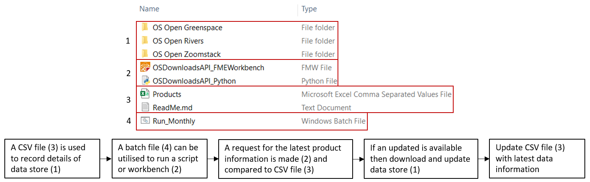
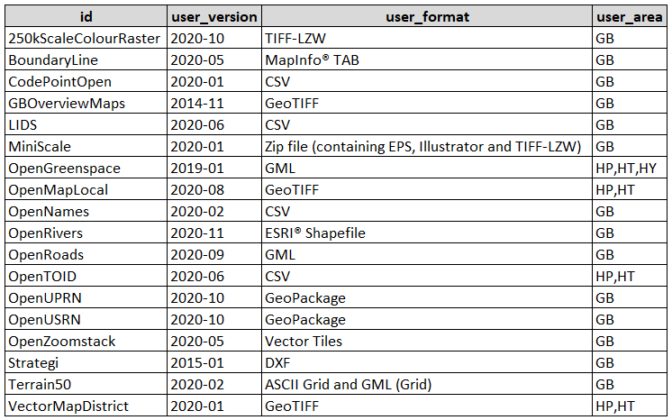
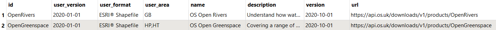
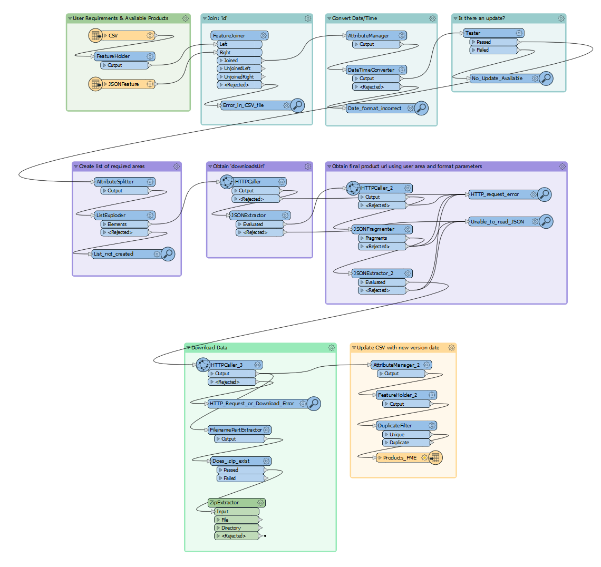

Automated download of OS OpenData products 
==================================

The [OS Downloads API](https://osdatahub.os.uk/docs/downloads/overview)
is a service that allows users to automate the discovery and download of
OS OpenData. This tutorial will demonstrate how a simple csv file can be
used alongside tools such as a python script or FME workbench, to
utilise the automated download feature and make sure you always have
the most up-to-date data on your servers. A script or workbench can be
run daily/weekly/monthly using a batch file and gives users the peace of
mind that they are always using the very latest datasets. Downloads will
only occur if an update is available therefore making the whole process
as efficient as possible.

The tutorial will discuss the methodology involved in downloading
available OS products, as well as providing examples in the format of a
[python script and FME workbench](./code). Please feel free to take a look at the
examples, have a play and then customise them for your own specific
needs.



*Example setup*

CSV
---

Firstly, we wanted a method of recording the status of our current
datasets and that would also be quick and easy to process within
different tools -- arriving at a simple csv format. The csv file stores
the latest version date of your datasets which are then compared against
the latest product version dates via the API.

All the user has to do is:

-   record which datasets they wish to download (`id`)

-   the date that they last downloaded the dataset (`user_version`)

-   which format they require the data to be in (`user_format`), ranging
    from CSV to GeoPackages

-   the area that the data needs to cover (`user_area`). The majority of
    the datasets can be downloaded with full GB coverage, however, there
    are currently four datasets where individual OS tiles can be
    selected.



*Example version of the csv file*

Once the user has initially setup the csv file, it does not need to be
edited again unless a new dataset is required, or they want to change
the data format/area.

Methodology
-----------

The attraction of the process that we will describe is its scalability
-- as and when new products arrive or old are retired on the OS
Downloads API, all the user has to do is update their csv file. All the
required information for a download is obtained via different calls to
the API (handled by a script or workbench), which will be highlighted
below.

It is worth noting that due to differences between various datasets, the
parameters can be different when it comes to downloading data. The
process below helps capture all the different permutations of various
requests which helps highlight the scalability credentials.

## 1: Products

We need to obtain the latest product information by making a request
to this url: <https://api.os.uk/downloads/v1/products>

The request returns data in a JSON format that contains useful
information about all the products available for download, including;
id, name, description, version and url.

```json
{
    "id": "250kScaleColourRaster",
    "name": "1:250 000 Scale Colour Raster™",
    "description": "Get the regional view of towns and villages, roads and places of interest.",
    "version": "2020-06",
    "url": "https://api.os.uk/downloads/v1/products/250kScaleColourRaster"
},
{
    "id": "BoundaryLine",
    "name": "Boundary-Line™",
    "description": "From Euro constituencies to council wards, Boundary-Line™ maps every administrative boundary in detail for you.",
    "version": "2020-10",
    "url": "https://api.os.uk/downloads/v1/products/BoundaryLine"
},
{
    "id": "CodePointOpen",
    "name": "Code-Point® Open",
    "description": "Get started with geographical analysis, simple route planning and asset management.",
    "version": "2020-11",
    "url": "https://api.os.uk/downloads/v1/products/CodePointOpen"
},
{
    "id": "GBOverviewMaps",
    "name": "GB Overview Maps",
    "description": "Our simplest maps of the British Isles.",
    "version": "2014-11",
    "url": "https://api.os.uk/downloads/v1/products/GBOverviewMaps"
},
{
    "id": "LIDS",
    "name": "OS Open Linked Identifiers",
    "description": "A comprehensive dataset of cross-referenced identifiers, between various OS data products.",
    "version": "2020-12",
    "url": "https://api.os.uk/downloads/v1/products/LIDS"
},
{
    "id": "MiniScale",
    "name": "MiniScale®",
    "description": "A simple overview map of Great Britain.",
    "version": "2021-01",
    "url": "https://api.os.uk/downloads/v1/products/MiniScale"
},
{
    "id": "OpenGreenspace",
    "name": "OS Open Greenspace",
    "description": "Covering a range of greenspaces in urban and rural areas including playing fields, sports’ facilities, play areas and allotments.",
    "version": "2020-10",
    "url": "https://api.os.uk/downloads/v1/products/OpenGreenspace"
}
```

*Sample of JSON result regarding products*

## 2: Version Dates

We need to determine which parts of this request are required, and that
is achieved by joining the results to a copy of our CSV file (joining on
id). This will keep only the information required based on which OS
products are listed in the file. In the same step, we can also format
the 'version' dates (from text to date) so we can compare and determine
if any updates are available.



*Example of join*

## 3: Product URL

If an update is available, we need to request another URL, this
time using the 'url' column information. This url will provide more
detailed information about the specific product, such as the
'downloadsUrl' and what formats and area coverage are available. This
information will be used to build our final request to receive the
download file. An example of this request (results in JSON format):
<https://api.os.uk/downloads/v1/products/OpenGreenspace>

```json
{
    "id": "OpenGreenspace",
    "name": "OS Open Greenspace",
    "description": "Covering a range of greenspaces in urban and rural areas including playing fields, sports’ facilities, play areas and allotments.",
    "version": "2020-10",
    "documentationUrl": "https://www.ordnancesurvey.co.uk/business-government/products/open-map-greenspace",
    "dataStructures": [
        "Vector"
    ],
    "category": "Greenspace",
    "formats": [
        {
            "format": "ESRI® Shapefile"
        },
        {
            "format": "GML",
            "subformat": "3"
        },
        {
            "format": "GeoPackage"
        }
    ],
    "url": "https://api.os.uk/downloads/v1/products/OpenGreenspace",
    "imageCount": 3,
    "imageTemplate": "https://api.os.uk/downloads/v1/products/OpenGreenspace/images/{index}",
    "downloadsUrl": "https://api.os.uk/downloads/v1/products/OpenGreenspace/downloads",
    "areas": ["GB","HP","HT","HU","HY","HZ","NA","NB","NC","ND","NF","NG","NH","NJ","NK","NL","NM","NN","NO","NR","NS","NT","NU","NW","NX","NY","NZ","SD","SE","SH","SJ","SK","SM","SN","SO","SP","SR","SS","ST","SU","SV","SW","SX","SY","SZ","TA","TF","TG","TL","TM","TQ","TR","TV"]
}
```

*All available parameters for downloading OS Open Greenspace*

## 4: DownloadsUrl

Every available dataset requires a unique URL in order to be downloaded,
so using the above example, a URL is required for each individual area
(e.g. HP, HT, HU etc). Within our python script and FME workbench, we
create a list of all the required areas as specified in the CSV file and
start to build our next request.

We take the `downloadsUrl` obtained in our previous request and add to
it the format we require the data (specified in CSV file) and complete
it with a specific area (from list created above). So, if I wanted OS
Open Greenspace, in GML format, for all of GB, then my request would
look like: <https://api.os.uk/downloads/v1/products/OpenGreenspace/downloads?format=GML&area=GB>

However, if I wanted the same product in shapefile format for areas HP
and HT, then I would require two separate requests that look like:

HP: [`https://api.os.uk/downloads/v1/products/OpenGreenspace/downloads?format=ESRI%C2%AE%20Shapefile&area=HP`](https://api.os.uk/downloads/v1/products/OpenGreenspace/downloads?format=ESRI%C2%AE%20Shapefile&area=HP)

HT: [`https://api.os.uk/downloads/v1/products/OpenGreenspace/downloads?format=ESRI%C2%AE%20Shapefile&area=HT`](https://api.os.uk/downloads/v1/products/OpenGreenspace/downloads?format=ESRI%C2%AE%20Shapefile&area=HT)

## 5: Product Download

We are almost there! Using the URL's we have created in step 4, we can
now make the requests that allow us to obtain the final download
link (see 'url' in example below) and the 'fileName' which allows us
to determine the download format e.g. zip, csv, vector tiles etc, and
also use to name the downloaded file.

```json
[
    {
        "md5": "38A059AEC5A63FFA95F6FFD942A4CBC9",
        "size": 4101,
        "url": "https://api.os.uk/downloads/v1/products/OpenGreenspace/downloads?area=HT&format=ESRI%C2%AE+Shapefile&redirect",
        "format": "ESRI® Shapefile",
        "area": "HT",
        "fileName": "opgrsp_essh_ht.zip"
    }
]
```

*The `url` is our download link, confirmed by the presence of `&redirect` at the end of the request*`

> Note: There are some datasets that contain multiple files for the same area,
for example, eleven CSV files are available to download for GB coverage
related to the OS Open Linked Identifiers dataset. Within the python
script and FME workbench, a list is created that loops through firing
off their individual download URL.

## 6: CSV Update

Once all the downloads have been processed, the latest version dates are
recorded and exported back out to the csv file so they can be used for
future comparisons and allow users to check which version they currently
have.

And that is it - all required datasets have been downloaded!

Software/Tools
--------------

Feel free to test the methodology by downloading the python script or
FME workbench. The python script was developed in v3.9 with the help of the
[pandas](https://pandas.pydata.org/pandas-docs/stable/getting_started/install.html)
software library and users will need to install this in order for the
script to run. It is also worth noting that no error catching currently
exists which might be worth implementing e.g. no/lost connection to API,
misspelt names in csv etc. The workbench was created and tested using
FME Desktop 2019.

```python
for index,row in dfMerge.iterrows(): # Iterate over dataframe rows
    if row['version'] > row['user_version']: # If the Product API date is greater than the users current version then an update is available
        print (">> Update available for {}. Currently downloading...".format(row['name']))
        # Variable
        dataFormat = row['user_format'] 
        # Create directory for download (if it doesn't already exist)        
        saveArea = os.path.join(realPath,row['id']) 
        check = os.path.isdir(saveArea)
        if check == False: 
            os.mkdir(saveArea)
        # Get product download URL
        r1 = requests.get(row['url']).json() 
        apiDownload = r1['downloadsUrl'] 
        # Create list for specified areas 
        userArea = row['user_area']
        areaID = userArea.split(",") 
        # Start of download process:
        for area in areaID: # Loop over area list e.g. GB or HP,HT etc 
            r2 = requests.get(apiDownload+"?format="+dataFormat+"&area="+area).json() # Obtain list of available files to download (fileName) and loop through (note: some datasets can have multiple files to download per area)
            for req2 in r2:
                with open (saveArea+"\\"+req2['fileName'], 'wb') as fd: # Using fileName captures the file extension e.g. csv, zip, mbtiles etc
                    download = requests.get(req2['url'], stream=True, verify=False )
                    for chunk in download.iter_content(chunk_size=128):
                        fd.write(chunk)
            print (">> {} has downloaded.".format(area))   
        print (">> Download complete for {}.". format(row['name']))
        row.at['user_version'] = row['version'] # Update the user_version column with the latest dates
    else:
        print (">> No updates available for {}, you have the latest version.".format(row['name']))

# Export dataframe to csv
dfMerge.to_csv(plLoc, index=False, columns =["id", "user_version", "user_format", "user_area"], encoding ='latin1' )
```

*Sample of python code*



# FME Workbench

You are also not limited to python or FME -- experiment with other
software or tools that you are familiar with and replicate the
methodology. For a bit of inspiration, see how Node JS has been used to
download Terrain50 data [here](https://labs.os.uk/public/os-data-hub-tutorials/web-development/automated-open-data-download).

Click [here](https://osdatahub.os.uk/) to sign up for the OS Data Hub.
Have any questions? Tweet [@OrdnanceSurvey](https://twitter.com/ordnancesurvey) and tag [#OSDeveloper](https://twitter.com/hashtag/osdeveloper).
