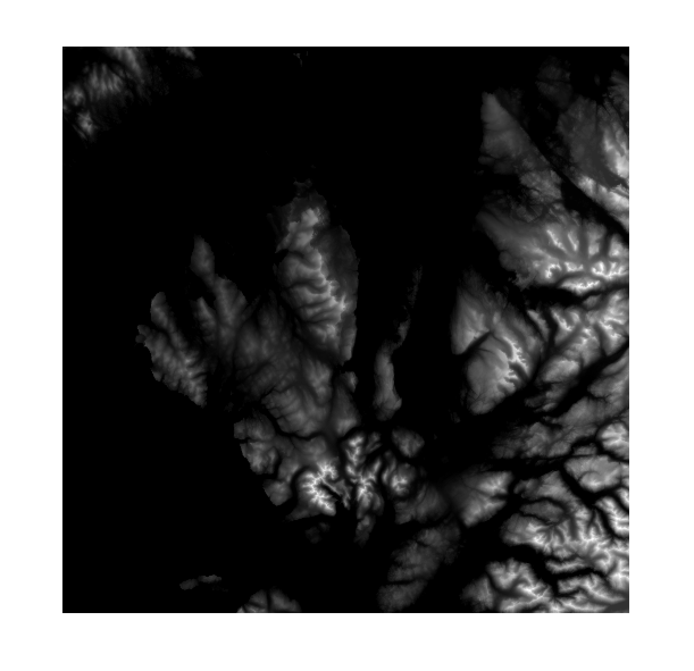
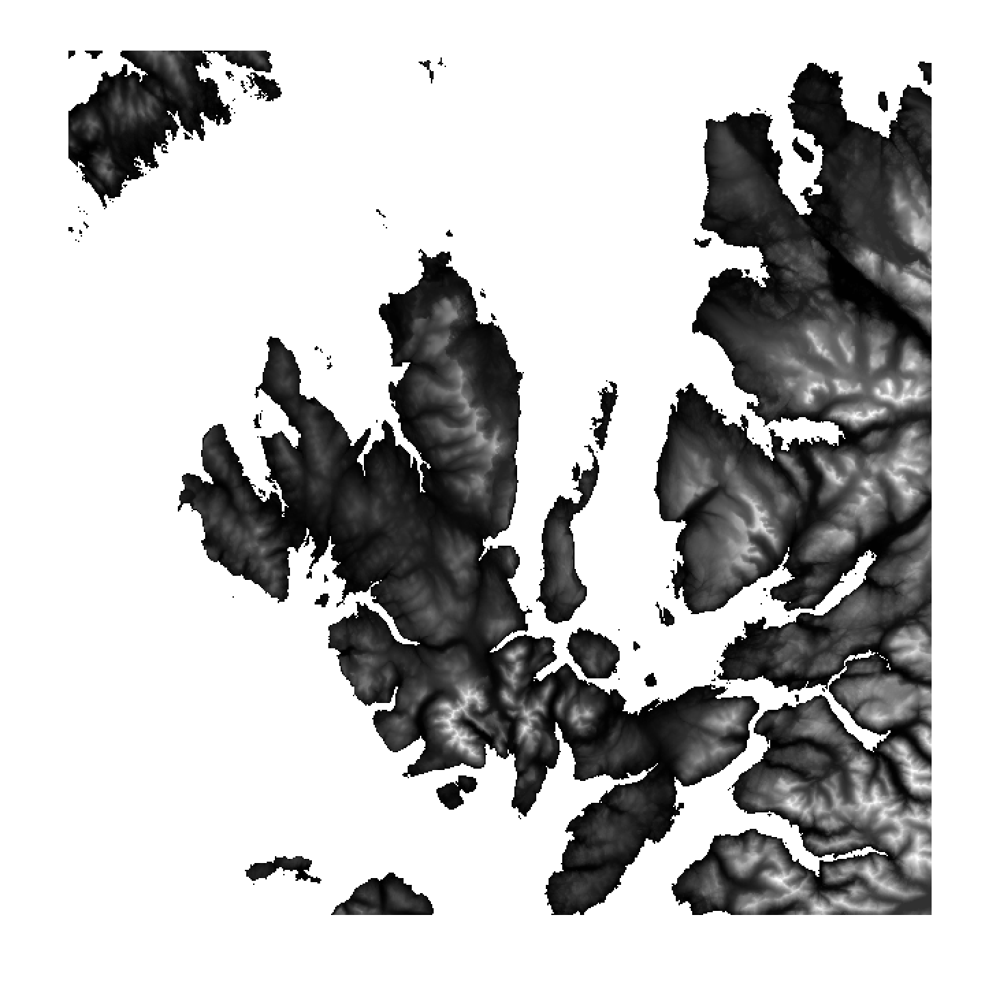
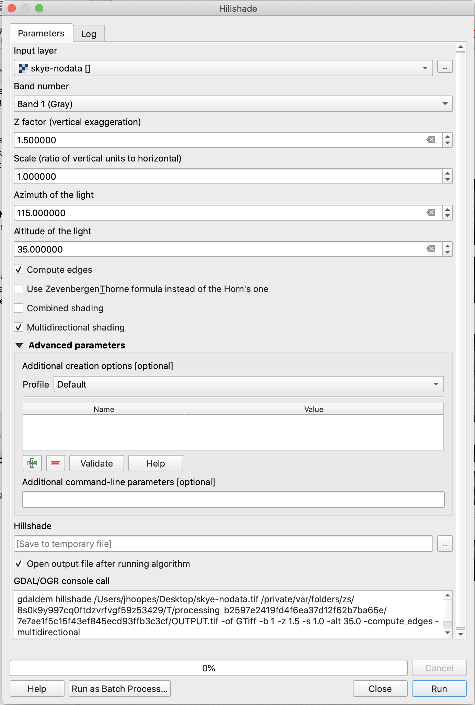
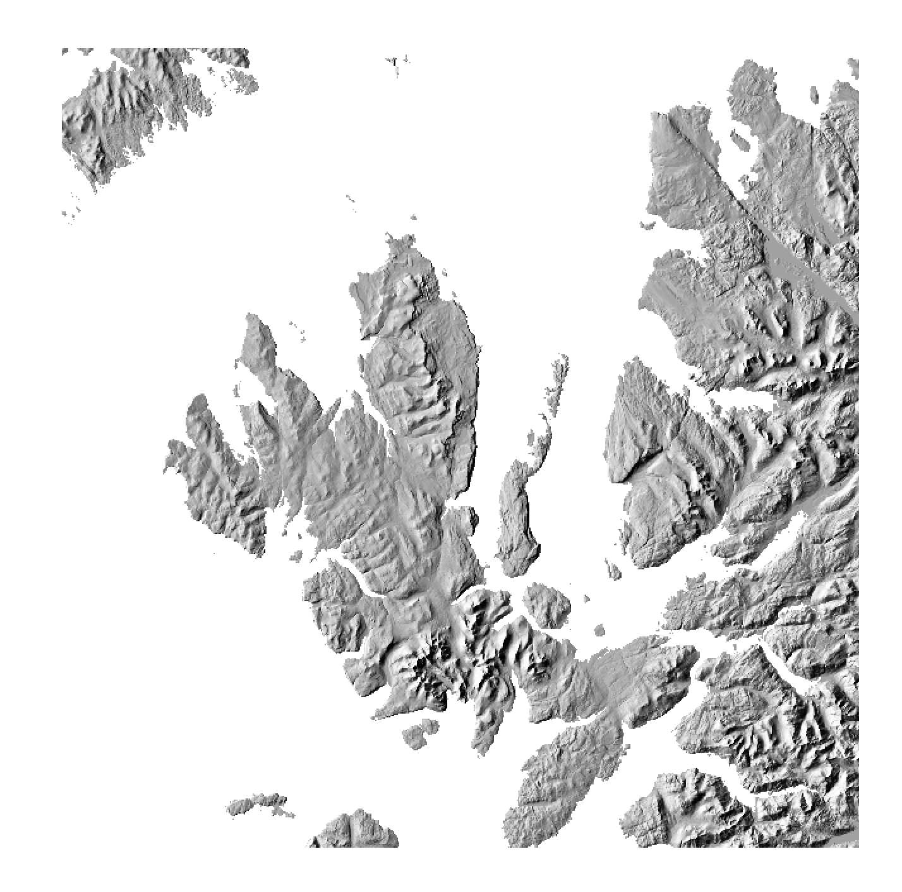
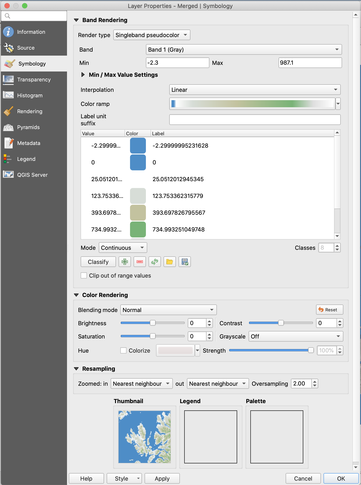
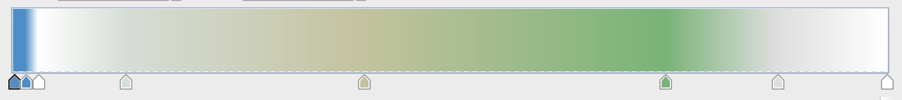
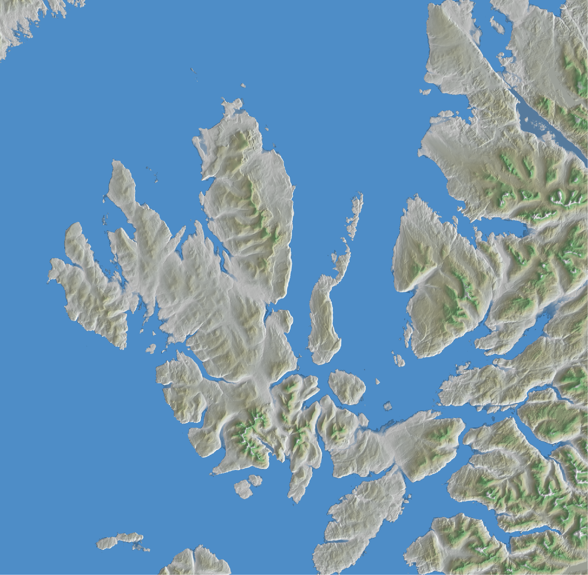

# Automated Download and Hillshade 

In this tutorial we'll collect Ordnance Survey data from the Downloads API with an automated download and extract process. Then we'll take the downloaded Terrain50 data into QGIS, where we'll create a stunning hillshade map of Scotland. 

**Image of what we're going for!**

## Tools and APIs

This tutorial is divided into two parts: Download & Extract and Hillshade in QGIS. 

The Download & Extract section will walk through how to fetch the OS Terrain50 Digital Elevation Model (DEM) dataset from the OS Downloads API using NodeJS and the command line, then unzipping and extracting all of the appropriate .asc files into a single folder. 

We'll then import the appropriate files into QGIS, where we'll explore how to create a shaded relief map from the DEM data. 

- NodeJS and npm
    - `axios` and `extract` npm packages; `fs` and `path` standard modules.
- Command line

## Tutorial

Working with large datasets can be a challenge. With a few programming tools, however, we can radically improve the efficiency of collecting and manipulating these datasets.

We'll be using NodeJS to download and extract Ordnance Survey's Terrain50 Digital Elevation Model dataset from the OS Downloads API. 

1. Download zipped directory with the data. 
2. Unzip all contained zipped directories.
3. Copy all `.asc` files into one folder, ready to be loaded into QGIS.

This tutorial was created using Node v14.1.0. [Here is a great tutorial](https://www.taniarascia.com/how-to-install-and-use-node-js-and-npm-mac-and-windows/) on installing Node and npm on Windows and Mac.

### Download & Extract

First, we'll download the Terrain 50 dataset from the OS Downloads API. In your terminal, make a directory where you'll want to store your project. At the outset we'll install the [`axios`](https://github.com/axios/axios) package from NPM, which is used for HTTP requests, and [`extract-zip`](https://www.npmjs.com/package/extract-zip), which we'll use a bit later on for extracting zipped folders. 

~~~bash
mkdir os-downloads-tutorial
cd os-downloads-tutorial

npm install axios extract-zip
~~~

If you're not familiar with Node, this `npm install` command will create a `node_modules` folder and download packages there. 

### Download File

We'll be breaking our Node program into modules to keep it organised. For our first step - downloading the dataset - create a file called `downloadFile.js` in the `os-downloads-tutorial` directory. 

We'll be using the `fs` module to write data to the disk as it downloads via an `axios` HTTP request. 

~~~javascript
const fs = require('fs');
const axios = require('axios');

/* ============================================================
Function: Uses Axios to download file as stream using Promise

/downloadFile.js
const download_file = (url, filename) =>
    axios({
        url,
        responseType: 'stream'
    }).then(
        response =>
            new Promise((resolve, reject) => {
                response.data
                    .pipe(fs.createWriteStream(filename))
                    .on('finish', () => resolve())
                    .on('error', e => reject(e));
            });
    );
~~~

This function will fetch the resource at the `url` passed in, and write the file returned to the local directory as `filename`. We will call it from the function we'll export, adding in some error handling and visual feedback so the user knows the file is downloading:

~~~javascript
/* ============================================================
Download File.

/downloadFile.js
============================================================ */
async function downloadAllGB(url, targetdir) {
    try {
        
        // Giving user feedback every 5 seconds in the terminal:
        console.log('Download starting ...')
        let interval = setInterval(() => console.log('...'), 5000)

        // Download the file, waiting until the promise is resolved
        await download_file(url, `${targetdir}.zip`);

        // Complete!
        clearInterval(interval);
        console.log(`Downloaded file ${download.area}`)
        console.log('Completed downloading files')
    } catch (error) {
        console.error(error);
    }
}

// And export the module so it is accessible when we import it elsewhere
module.exports = downloadAllGB;
~~~

### Recursive Unzip 

Before we import and call the code above, we'll also define a `unzipAll.js` script, which will unzip all the zipped folders in the downloaded zipfile.

Create a file called `unzipAll.js`. This function will accept one parameter - a path to a directory (zipped or not). We'll then pull paths of all contained zipfiles and unzip and delete them all. Since zipped directories can contain zipped sub-directories and files, we need to execute this recursively until all files ending in `.zip` are extracted and deleted.

~~~javascript
// Import dependencies, including the extract-zip module we installed with npm
const fs = require('fs')
const path = require('path')
const extract = require('extract-zip')
const getFilePaths = require('./getFilePaths.js')

async function unzipAll(dir) {

    dir = path.resolve(dir)
    
    // Create an array of all .zip file paths in the directory:
    let filepaths = getFilePaths(dir)
    filepaths = filepaths.filter(filepath => path.extname(filepath) === '.zip')
    
    // Loop through filepaths, extracting and deleting each:
    while (filepaths.length > 0) {
        for (let file of filepaths) {

            let parsedpath = path.parse(file);
            let targetdir = path.resolve(parsedpath.dir);

            try {

                // Unzip the compressed file into a directory with the same name
                await extract(file, { dir: targetdir})
                await fs.unlinkSync(file); // <- delete the .zip file
                console.log('Unzipped', parsedpath.base + ", deleted .zip file.")
            } catch (err) {
                console.log(err)
              }
        }

        // Edge case: if the input parameter dir was a zipfile
        let parsed = path.parse(dir);
        if (parsed.ext === '.zip') {
            dir = path.resolve(parsed.dir, parsed.name); // the now-extracted zipped directory
        }

        // If the extracted folders contained zipfiles, they'd be included here:
        filepaths = getFilePaths(dir)
        filepaths = filepaths.filter(filepath => path.extname(filepath) === '.zip')
    }
}

// Since we'll be importing it into our main JS file, we export the function:
module.exports = unzipAll;
~~~

### `getFilesPaths()`

You'll notice we required a module to `unzipAll` - `getFilePaths.js`. 

This function accepts a directory path string, then loops through the directory, building an array of all the paths to directories and files contained. 

A note: this is another recursive function - one that calls itself. In this way it is able to move through the directory structure no matter its depth.

~~~javascript
const fs = require('fs');
const path = require('path');

/** Retrieve file paths from a given folder and its subfolders. */
/* Big thanks to @darioblanco on https://gist.github.com/kethinov/6658166 
    for sharing this code!! */
const getFilePaths = (folderPath) => {

    // Edge case: if a .zip file is passed in, we'll return that ready to unzip
  if (fs.statSync(folderPath).isFile() 
      && path.parse(folderPath).ext === '.zip') {
    return [folderPath];
  }

  // An array of path strings for the contents of the directory
  const entryPaths = fs.readdirSync(folderPath).map(entry => path.join(folderPath, entry));
  // An array of all the files in the directory
  const filePaths = entryPaths.filter(entryPath => fs.statSync(entryPath).isFile());
  // An array of all the directories in the directory
  const dirPaths = entryPaths.filter(entryPath => !filePaths.includes(entryPath));
  // Recursively travel down the directory tree, concatenating the contents of each subdirectory
  // dirFiles contains all the files with a directory 'depth' greater than one. 
  const dirFiles = dirPaths.reduce((prev, curr) => prev.concat(getFilePaths(curr)), []);
  
  // Combine all the paths into a single array with the ES6 spread operator
  return [...filePaths, ...dirFiles];

};

module.exports = getFilePaths;
~~~

Now we've downloaded the DEM data from the OS Downloads API and unzipped all the contained files. It *should* be ready to bring into QGIS. 

### `app.js`

Let's put this all together in a new file, `/app.js`. We'll import the modules we need - Node's `fs` and `path`, along with the custom modules we wrote above. 

We don't want to click through every single folder to select the .asc files we need to load into QGIS - and Q won't accept a directory containing loads of subdirectories and contained files of different types.  

Fortunately, with Node - and the code we've already written - we can easily copy all the .asc files from their locations in the directory structure into one folder.

We will place all of this code inside the body of an [asynchronous immediately-invoked function expression](https://developer.mozilla.org/en-US/docs/Web/JavaScript/Reference/Operators/async_function), which you can see in `/app.js`. 

~~~javascript
const fs = require('fs').promises;
const path = require('path');
const getFilePaths = require('./getFilePaths.js');
const downloadFile = require('./downloadFile.js');
const unzipAll = require('./unzipAll.js');

// We use an IIFE because`await` can only work inside an `async` function.
(async () => {

    const terrain50url = 'https://osdatahubapi.os.uk/downloads/v1/products/Terrain50/downloads?area=GB&format=ASCII+Grid+and+GML+%28Grid%29&redirect';
    const targetDir = './working_data';

    // // Await download and unzip:
    await downloadFile(terrain50url, targetDir)
    await unzipAll(targetDir);

    // Now we have a directory with several subdirectories containing, among other files, .asc grids representing elevations of 50m raster cells.
    // Let's extract an array of all paths then filter .asc files in the NG grid square:
    let allPaths = getFilePaths(targetDir)
    let ascPaths = allPaths.filter((filepath) => 
        ((path.parse(filepath).ext === '.asc') &&
        filepath.includes('/ng/')))

    // We'll create a directory to hold our .asc files
    let ascTarget = path.resolve(targetDir, 'asc_skye/')
    await fs.mkdir(ascTarget)

    // Then loop through and copy each file into this ./asc folder
    for (let i = 0; i < ascPaths.length; i++) {
        let parsedpath = path.parse(ascPaths[i]);
        let target = path.resolve(ascTarget, parsedpath.base)
        await fs.copyFile(ascPaths[i], target);
        console.log("Copied", parsedpath.base);
    }

    console.log('Completed copying .asc files!')

})()
~~~

### Running the program

We now have a complete Node program and modules, which we can execute by running `node app.js` on the command line in our `os-downloads-tutorial` directory.

This may take a little time as the OS Terrain 50 dataset is 161MB. Once this is completed, there should be a new folder, `working_data/asc_skye` with the `.asc` files, ready to work with in QGIS.

## Shaded Relief in QGIS

Now we've got a folder containing the OS Terrain 50 Digital Elevation Model raster tiles around the Isle of Skye. There are lots of uses for this data - we're going to create a shaded relief map showing the topography of the Inner Hebrides. 

We're using QGIS3 - if you haven't installed it, you can find it [here](https://qgis.org/en/site/). Open up the program and create a `New Empty Project`.

Drag and drop the `.asc` files into the QGIS layers pane. Each file should appear in the pane, along with a tiled image of the land area in the viewport. We'll go through a few steps to get our map ready. 

### Merge tiles

First we'll merge the DEM tiles into a single image. Select `Raster > Miscellaneous > Merge...` from the menu; a dialogue box will pop up. First add all the tiles as the input elements with the `...` button next to the input layers text box. (Note: in some versions of QGIS for Mac, pressing `OK` sometimes moves the `Merge` textbox behind the main window, so you may have to move it back to the front.) 

Leave the other parameters as-is and click `Run`. The console will show output as the tiles are merged, and a layer called `Merged` should be added to the `Layers` pane, and a black-and-white image should appear over top the tiles we added. Close the `Merge` popup and examine the new merged raster image - notice how you can no longer see the edges of the individual tiles.

You can now remove the individual tiles from the Layers panel by highlighting them all and `right-click > Remove Layer...`. This will clean up your interface, but won't delete the original data from your disk. 

### Removing `nodata`

We need to remove the nodata values of the new merged tile we created. To do this, right click on the layer and select `Export > Save As`. Choose a filename and location to save, then scroll down and toggle the `No data values` checkbox, add a row with the green `+` and input `-2.3` to `0` as the range. 

Clicking `OK` will create a new raster layer with the `nodata` (i.e. sea) values excluded.  This DEM representing the landforms of western Scotland is ready for our analysis.

### Create the hillshade layer

In the digital elevation model we created with the `nodata` pixels removed, each grid cell has a numerical value representing the average height of that terrain area in meters above sea level. 

A hillshade analysis calculates the amount of light reflecting off of a grid cell based on its elevation, and the elevation of surrounding cells. To do so, the algorithm is provided the raster grid, along with parameters including the `azimuth` and `altitude` of the light source, as well as vertical exaggeration (`ZFactor`), and `scale`.

Select the `Raster > Analysis > Hillshade` option from the main menu - a dialogue to configure the parameters of the hillshade analysis will appear.

Feel free to play around with these parameters to create a hillshade image you like. We used the following settings for our map, to simulate morning on the west coast:

| Parameter | Value |
| --- | --- |
| `azimuth` | 115 |
| `altitude` | 35 |
| `ZFactor` | 1.5 |
| `scale` | 1 | 
| `Compute edges` | `true` |
| `Multidirectional shading` | `true` |

`Run` generates the hillshade image layer from the `Merged` raster and the input parameters and adds it to the map. 

### Styling in QGIS

A last bit of styling and we have a shaded relief map of the Isle of Skye!

These parameters are entirely up to you, so tune and toggle until you find an aesthetic that suits your use. 

First, we'll apply a style to the Terrain 50 DEM layer. Rather than the basic black-to-white gradient, we created one that would emphasise the different terrain altitudes - white at the lowest points, moving through a muted brown, to a subtle forest green, then light grey at the mountain tops. 

We will work on the `Merged` raster, which incudes the ocean and water surfaces as values less than 0.

Access this image's Layer Properties dialogue by right-clicking on the DEM layer and selecting `Properties`, then the `Symbology` tab. Change `Render type` to `Singleband pseudocolor`, then select `Create new color ramp` on the `Color ramp` dropdown. Select `Gradient` and create your own color ramp. You can click just below the ramp to add stops and select colors within `Gradient Stop`.

Once you have your color ramp, click `Classify` so each stop on the ramp is added to the list of labels. Finally, click `Apply` to update the rendered layer and see your work visualized. 

We adjusted the lower blue cut-off value to 0 so only cells below sea level would appear as water. 

The last step is styling the hillshade layer we created with our analysis. Make sure this layer is on top of the Terrain 50 layer we just styled, and open the `Layer Properties > Symbology` interface again. 

Invert the color gradient to `White to black` - the eastern side of the peaks should be in the sun in the morning. Switch `Blending mode` to `Multiply` and increase `Brightness` a bit. We also switched the Resampling mode to `Bilinear` in, `Average` out.

As the last step, we set the overall `Transparency` of the layer to 50%.

There we go - a shaded relief map of western Scotland, focused on the Isle of Skye. Data collected from the OS Downloads API with NodeJS, analysis done in QGIS.

If you make a beautiful map using OS data - let us know!

 

---

# 👇 Deprecated

1. Download the Terrain50 dataset from the OS Downloads API.
2. Extract a few adjacent tiles
3. 

## QGIS

---

Copy of the tutorial can go here.

Resouces:

On Node fs: https://www.freecodecamp.org/news/node-js-streams-everything-you-need-to-know-c9141306be93/

## API Endpoints

## NodeJS

This section will look at how to automate the download of data from the OS Data Hub API with NodeJS.

First off - make sure you have [Node](https://nodejs.org/en/) installed. (Here's [a guide](https://www.taniarascia.com/how-to-install-and-use-node-js-and-npm-mac-and-windows/) if you don't already do.) 

We'll be focused on automating the download of the datasets and writing them to disk. To do this, though, we will look at the product details files that help us understand how to fetch data from the API. 

### init and installation

Before we access the Downloads API, we'll install `axios`, a Node package for making HTTP requests using promises. 

~~~bash
# On the command line
$ npm install axios
~~~

This will create a `./node_modules` directory and install the module. 

### The Product List

First, we'll look at the list of products available via the API, available at `https://osdatahubapi.os.uk/downloads/v1/products`. A request sent to this URL returns a JSON array of the 14 OS data products accessible through the API.

An advantage to this serving JSON is that we can parse and access the product-specific information using common libraries, including JavaScript's standard built in `JSON` object, with `.parse()` and `.stringify()` methods. By parsing the JSON returned by the API, we can loop through it, access each object's properties,and so on. 

Here we will look at the first few lines of `/code/node/list-products.js`, a module that will fetch a file describing the products available. Note that we assign the function to `module.exports`; this means 

~~~javascript
const axios = require('axios');

module.exports = async function listProducts() {
    const productList = await axios('https://osdatahubapi.os.uk/downloads/v1/products');

    console.log(productList.data); // <- print into console
    for (const product of productList.data) {
        console.log(product.id)
    }
}
~~~

Each dataset available via the API 
=======
The languages, libraries, APIs and external data sources we'll use to complete this tutorial.

## Tutorial

Copy of the tutorial can go here.
